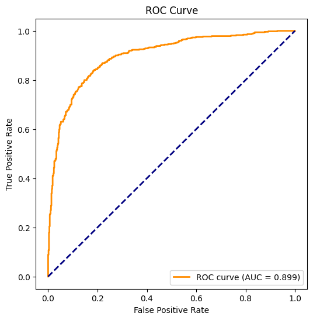
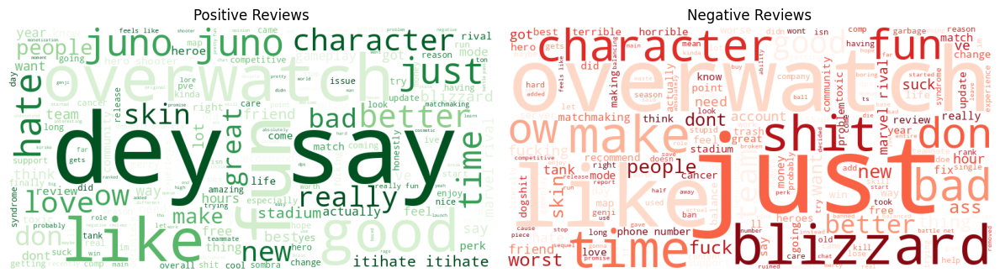

# Steam Review Sentiment & Telemetry Pipeline (NLP)

### **Project Overview**
An end-to-end Data Engineering & Analytics pipeline designed to ingest real-time player feedback, perform automated quality assurance (QA) on unstructured text, and utilize a fine-tuned BERT Transformer model to classify player sentiment.

This project demonstrates the architecture required to monitor game health and user telemetry for live-service titles like Overwatch 2, translating raw community feedback into actionable QA metrics.

### **Business Problem**
Modern live-service games generate millions of unstructured player reviews. Manual analysis is impossible at scale, leading to:
* Delayed bug identification.
* Missed community sentiment trends.
* Inability to correlate gameplay hours with user satisfaction.

### **Technical Solution**
I developed a Python pipeline that automates the lifecycle of player data:

**1. Ingestion (ETL & API Integration)**
* **Source:** Utilizes the Steam Public API to fetch live player reviews in JSON format.
* **Extraction:** Implemented cursor-based pagination to handle high-volume data retrieval.
* **Target:** Standardized Pandas DataFrame structure for downstream processing.

**2. Data Quality Assurance (QA)**
* **Sanitization:** Built Regex filters to strip HTML tags, non-standard characters, and spam.
* **Normalization:** Leveraged Steam API parameters to ingest strictly English-language telemetry, ensuring compatibility with the DistilBERT model.
* **Validation:** Removed duplicates and enforced minimum character counts to ensure high-quality input features.

**3. Machine Learning Architecture**
* **Model Selection:** Selected **DistilBERT** (a distilled version of BERT) for its balance of high performance and inference speed. This Transformer-based architecture captures the contextual nuance of gaming jargon (e.g., "buggy," "pay-to-win") better than traditional Bag-of-Words models.
* **Performance:** Achieved **~90% Accuracy** (F1 Score: 0.90) on the test set.
* **Optimization:** Utilized GPU acceleration (CUDA) for efficient training loops.

---

### **Scalability & Performance (Big Data Context)**
While this repository demonstrates a live API fetch for real-time analysis, the underlying model architecture was rigorously tested on enterprise-scale data:

* **Training Scale:** The core model was originally trained and validated on a 10GB+ dataset containing over 10 million records of historical (2020-2024) Steam data.
* **Optimization:** Implemented chunking strategies and memory-efficient data handling in Python to process high-volume logs within memory-constrained environments.
* **Deep Dive:** For a full breakdown of the theory and big data architecture, please view the [Technical Whitepaper (PDF)](Architecture-Deep-Dive-10GB-Dataset.pdf) included in this repo.

---

### **Key Metrics & Visualizations**

**1. Model Performance (Confusion Matrix)**
Validates the model's precision in identifying negative sentiment; crucial for QA teams identifying bugs or UX issues.


**2. Discriminative Power (ROC Curve)**
Demonstrates strong separability (AUC = 0.899) between positive and negative player experiences.



**3. Semantic Analysis (Word Cloud)**
Visualizes trending keywords in positive vs. negative reviews, identifying core drivers of player satisfaction.



---

### **Technologies Used**
* **Language:** Python 3.x
* **ETL/Data Manipulation:** Pandas, NumPy, Requests (API)
* **ML/AI Frameworks:** PyTorch, Hugging Face Transformers, Scikit-Learn
* **Visualization:** Matplotlib, Seaborn

### **How to Run**
1.  Clone the repository:
    ```bash
    git clone [https://github.com/YOUR_USERNAME/Steam-Review-Sentiment-Pipeline.git](https://github.com/YOUR_USERNAME/Steam-Review-Sentiment-Pipeline.git)
    ```
2.  Install dependencies:
    ```bash
    pip install -r requirements.txt
    ```
3.  Run the notebook/script:
    * Open `Steam-Review-Sentiment-Pipeline.ipynb` in Jupyter or Google Colab.
    * Run all cells to fetch live data for Overwatch 2 (AppID: 2357570) and classify sentiment.
